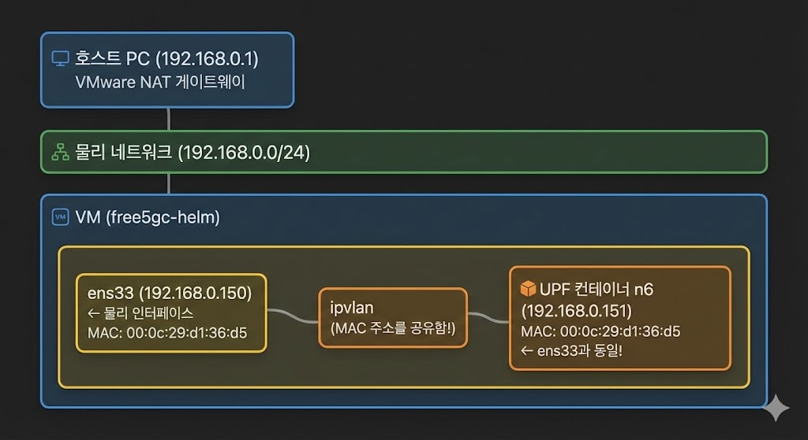

# free5gc-helm 설정 가이드라인 - by 호진

https://free5gc.org/guide/7-free5gc-helm/#prerequirements를 기반으로 오류 사항 개선

# Prerequirements

## 1. 설치 환경

- Virtualization: VMware Workstation Pro
- OS: Ubuntu-22.04.4-live-server-amd64
- Network Adapter : Bridged
    - IDE (예: vscode, cursor, antigravity)로 VM에 SSH로 접속하여 작업하는 것을 권장

## 2. 설치

- MicroK8s
    
    ```bash
    sudo snap install microk8s --classic --channel=1.28/stable
    ```
    
- kubectl
    
    ```bash
    sudo snap install kubectl --classic
    ```
    
- helm
    
    ```bash
    sudo snap install helm --classic
    ```
    

## 3. Set `sudo` group and join

```bash
sudo groupadd microk8s
sudo usermod -aG microk8s $USER
newgrp microk8s
```

## 4. Set `microk8s` work with local `kubectl`

참고: https://canonical.com/microk8s/docs/working-with-kubectl

```bash
mkdir -p ~/.kube
chmod 0700 ~/.kube
microk8s config > ~/.kube/config
```

## 5. GTP5G 커널 모듈 설치

```bash
# 1. 필수 패키지 설치
sudo apt update
sudo apt install -y git gcc cmake make linux-headers-$(uname -r)
# 2. gtp5g 소스 클론
cd ~
git clone https://github.com/free5gc/gtp5g.git
# 3. 빌드 및 설치
cd gtp5g
make
sudo make install
# 4. 커널 모듈 로드
sudo modprobe gtp5g
# 5. 설치 확인
lsmod | grep gtp5g
```

# IP 포워드 구성

- 버전 1.19부터 MicroK8s 클러스터는 기본적으로 **Calico CNI**를 사용함
    - UPF에서 IP 포워딩을 활성화하려면 Calico CNI에 몇 가지 필수 구성이 필요함

## 1. IP 포워딩을 위해 Calico CNI 설정

```bash
sudo nano /var/snap/microk8s/current/args/cni-network/cni.yaml # 입력 후 아래와 같이 수정
```

```yaml
...
kind: ConfigMap
...
data:
		...
		cni_network_config: |-
				{
						...
						"plugins": [
								{
										"type": "calico",
										...
										"kubernetes": {
												"kubeconfig": "**KUBECONFIG_FILEPATH**"
										},
										# append IP forwarding settings
										"container_settings": {
												"allow_ip_forwarding": true
										} # 여기 ',' 없는 거 중요
								}
						]
				}
```

## 2. IP 포워딩을 위해 kubulet args 설정

```bash
sudo nano /var/snap/microk8s/current/args/kubelet # 입력 후 아래와 같이 수정
```

```bash
# 맨 아래 줄에 아래 line 삽입
--allowed-unsafe-sysctls "net.ipv4.ip_forward"
```

## 3. 설정 적용 및 microk8s 재시작

```bash
# CNI 구성 적용
kubectl apply -f /var/snap/microk8s/current/args/cni-network/cni.yaml
# mnicroK8s 재시작
microk8s stop
microk8s start
```

# Addons 활성화

```bash
sudo microk8s enable community
sudo microk8s enable multus
sudo microk8s enable hostpath-storage
```

# 영구 볼륨 생성

## 1. Mongodb 볼륨

- 저장 디렉토리 생성: `/home/usr/mongo`
- YAML 파일 생성: `persistent-vol-for-mongodb.yaml`
    - work_node_name은 `microk8s kubectl get nodes` 로 확인

```yaml
apiVersion: v1
kind: PersistentVolume
metadata:
  name: free5gc-pv-mongo
  labels:
    project: free5gc
spec:
  capacity:
    storage: 8Gi
  accessModes:
  - ReadWriteOnce
  persistentVolumeReclaimPolicy: Retain
  storageClassName: microk8s-hostpath
  local:
    path: <mongo_storage_dir> # edit to your own path, like: /home/use/mongo
  nodeAffinity:
    required:
      nodeSelectorTerms:
      - matchExpressions:
        - key: kubernetes.io/hostname
          operator: In
          values:
          - <work_node_name> # edit to you node name
```

- `kubectl` 로 적용

```bash
cd ~/mongo
kubectl apply -f persistent-vol-for-mongodb.yaml
```

## 2. Cert 볼륨

- 저장 디렉토리 생성: `/home/usr/cert`
- YAML 파일 생성: `persistent-vol-for-cert.yaml`
    - work_node_name은 `microk8s kubectl get nodes` 로 확인

```yaml
apiVersion: v1
kind: PersistentVolume
metadata:
  name: free5gc-pv-cert
  labels:
    project: free5gc
spec:
  capacity:
    storage: 2Mi
  accessModes:
  - ReadOnlyMany
  persistentVolumeReclaimPolicy: Retain
  storageClassName: microk8s-hostpath
  local:
    path: <cert_storage_dir> # edit to your own path, like: /home/use/cert
  nodeAffinity:
    required:
      nodeSelectorTerms:
      - matchExpressions:
        - key: kubernetes.io/hostname
          operator: In
          values:
          - <work-node-name> # edit to your node name
```

- `kubectl` 로 적용

```bash
cd ~/cert
kubectl apply -f persistent-vol-for-cert.yaml
```

## 3. 볼륨 확인

```bash
kubectl get pv
```

# Helm Chart

## 1. github에서 free5gc-helm 클론

```bash
cd ~
git clone https://github.com/free5gc/free5gc-helm.git
```

# 네트워크 구성

`free5gc-helm/charts/` 내부의 `free5gc/` ,`loxilb/` ,`packetrusher/` ,`ueransim/` 의 모든 구성에서 `values.yaml` 을 올바르게 설정해야 함

- 예를들어, `free5gc-helm/charts/free5gc/values.yaml` 의 경우에는  `N2`/`N3`/`N4`/`N6`/`N9` 인터페이스 에서 `masterIf` 를 `ens33` (`ifconfig`로 확인할 수 있는 인터페이스명)으로 수정
- 또한 `free5gc-helm/charts/values.yaml` 를 아래와 같이 수정
    
    ```yaml
    global:
    ...
    	n6network:
    		enabled: true
    		name: n6network
    		type: ipvlan
    		masterIf: ens33
    		subnetIP: 192.168.0.0
    		cidr: 24
    		gatewayIP: 192.168.0.1
    		excludeIP: 192.168.0.1
    ...
    # 아래 ip는 네트워크에 없는 것을 확인한 후 입력 (이미 존재하는 ip면 다른 ip로 입력)
    free5gc-upf:
      upf:
        n6if:
          ipAddress: 192.168.0.200
      upf1:
        n6if:
          ipAddress: 192.168.0.201
      upf2:
        n6if:
          ipAddress: 192.168.0.202
      upfb:
        n6if:
          ipAddress: 192.168.0.200
    ...
    ```
    

# Chart 설치

## 1. free5gc namespace 생성

```bash
kubectl create ns free5gc
```

## 2. free5gc chart 설치

```bash
cd ~/free5gc-helm/charts
helm install -n free5gc free5gc-helm ./free5gc/
```

## 3. UERANSIM chart 설치

```bash
cd ~/free5gc-helm/charts
helm install -n free5gc ueransim ./ueransim/
```

## 4. 설치 확인

- 설치된 charts 확인

```bash
helm ls -A
```

- 설치된 Sevices, pods, 그리고 demployments 확인

```bash
# status at each pod is expected as "Running"
kubectl get all -n free5gc
```

- UPF에서 IP 포워딩 확인

```bash
# output should be '1'
kubectl exec -it -n free5gc deployment/free5gc-helm-free5gc-upf-upf1 \
    -- cat /proc/sys/net/ipv4/ip_forward
```

## 1. Web console (`http://<VM의 IP>:30500`)에서 subscriber 등록

로그인 ID: admin

로그인 pw: free5gc


## 2. GTP-Tennel로 Ping test

```bash
kubectl exec -it -n free5gc deployment/ueransim-ue \
    -- ping -I uesimtun0 8.8.8.8
```

## Ping test 안 될 시 해결 방법

1. **네트워크 타입 변경: `ipvlan` → `macvlan`**  
    
    **파일 2개 수정:**
    
    - **/home/hojin/free5gc-helm/charts/free5gc/values.yaml**
    - **/home/hojin/free5gc-helm/charts/ueransim/values.yaml**
    
    ```yaml
    # 모든 network의 type을 macvlan으로 변경
    n2network:
      type: macvlan# ipvlan에서 변경
    n3network:
      type: macvlan
    # ... (n4, n6, n9 모두 동일하게)
    ```
    
2. **Helm 재설치**
    
    ```bash
    # helm uninstall
    helm uninstall -n free5gc free5gc-helm
    helm uninstall -n free5gc ueransim
    
    # helm install
    cd ~/free5gc-helm/charts
    helm install -n free5gc free5gc-helm ./free5gc/
    helm install -n free5gc ueransim ./ueransim/
    ```
    
3. **gNB/UE 재시작 (AMF 준비 후)**
    
    ```bash
    kubectl rollout restart deployment/ueransim-gnb -n free5gc
    kubectl rollout restart deployment/ueransim-ue -n free5gc
    ```
    
4. **다시 Ping 시도**
    
    ```bash
    kubectl exec -it -n free5gc deployment/ueransim-ue \
        -- ping -I uesimtun0 8.8.8.8
    ```
    

### ipvlan이 잘 동작하지 않는 이유

사실 free5gc-helm은 VM 환경에서 사용하는 것을 고려하지 않음.

**ipvlan은 부모 인터페이스 (ens33)와 MAC 주소를 공유함. (아래 그림 참고)**

1. UPF가  `192.168.0.1`에게 "너 MAC 주소 뭐야?" (ARP Request) 물어봄
2. 게이트웨이가 대답을 보냄
3. **근데 그 응답이 `ens33`의 MAC으로 오니까**, VM의 네트워크 스택이 먼저 받아버림
4. **UPF 컨테이너까지 전달이 안 됨!**

**해결책: macvlan 사용**: 각 컨테이너에 **별도의 MAC 주소**를 부여해서 독립적으로 통신

